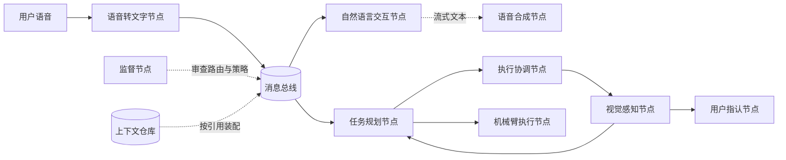

# BusAgent

BusAgent 是一个面向机器人与实时人机交互场景的总线式多智能体框架构想。它将任务规划、自然语言交互、感知、执行、语音合成和安全监督等能力拆分为可寻址节点，让消息通过总线并行、流式且有序地流转。

> 当前状态：设计与项目筹备阶段。本仓库暂不包含运行时代码，文档描述的是目标架构、约束与待验证假设，而不是已经交付的功能。

## 为什么需要 BusAgent

传统 Agent 通常由一个主模型维持上下文、决定工具调用，并以近似线性的方式推进任务。这种方式易于起步，但在机械臂等实时系统中会逐渐暴露问题：

- 规划、感知、执行和人机沟通彼此等待，端到端延迟被串行步骤累加；
- 完整文本生成后才进入语音合成，无法充分利用流式输出；
- 主模型承担过多上下文和工具决策，既昂贵，也容易误用能力；
- 多条用户指令同时到达时，任务之间的顺序、资源占用和取消关系难以维护；
- 机械臂执行器只能顺序执行，但感知、规划和回复生成又适合并行，两类约束很难放进同一条线性链路。

BusAgent 的核心判断是：许多智能任务的具体内容不同，但处理步骤、节点职责和转移条件具有稳定结构。与其让一个主 Agent 重复协调所有步骤，不如让每个专职节点依据明确的契约、提示词和策略，自主决定下一跳，并由总线维护消息身份、顺序和上下文关联。

## 核心理念

| 理念 | 含义 |
| --- | --- |
| 总线驱动 | 节点通过统一消息总线解耦，不依赖固定的点对点调用链。 |
| 职责明确 | 规划、对话、感知、执行、安全等能力由专职节点承载。 |
| 并行优先 | 无资源冲突的工作可同时推进，例如规划与首次语音反馈。 |
| 流式优先 | 节点可声明流式输入或输出，让下游尽早开始处理。 |
| 有序可追踪 | 每条指令和派生消息都有稳定标识、关联关系和序号。 |
| 上下文按需装配 | 消息只引用所需上下文分块，节点请求时再自动装配。 |
| 监督而非包办 | 监督节点审查路由和策略，不重新成为承担全部工作的主 Agent。 |

## 一个典型流程

用户说：“帮我找到绿色的咖啡杯并递给我。”



语音被转写后，可同时发往任务规划与自然语言交互节点。对话节点立即流式生成“我开始寻找绿色咖啡杯”，语音合成无需等待整段文本结束；与此同时，规划节点拆解任务，执行协调节点安排视觉定位。视觉节点返回目标与置信度后，规划节点决定继续抓取、请求用户确认，或触发新的观察。机械臂执行仍按资源约束串行进行，但其余节点无需同步阻塞。

更完整的事件时序见 [机械臂场景示例](docs/robotics-scenario.md)。

## 架构概览

BusAgent 由以下逻辑组件组成：

- **消息总线**：接收、编号、路由和投递消息，维护关联关系与交付状态；
- **能力节点**：执行单一或紧密相关的职责，可由模型、传统算法、硬件驱动或人工确认实现；
- **任务规划节点**：把意图转换为带依赖与条件的任务计划，并随结果更新计划；
- **执行协调节点**：管理共享资源、串行执行单元、取消和抢占；
- **监督节点**：检查下一跳、权限、安全策略和上下文使用，并提供受控修正；
- **上下文仓库**：保存可版本化的上下文分块，通过引用按需注入节点请求；
- **可观测性组件**：把一次用户指令下的消息、节点决策和执行结果串成完整轨迹。

详细设计见 [架构说明](docs/architecture.md)。

## 设计边界

BusAgent 重点解决：

- 低延迟、多节点并行的人机交互；
- 流式内容在不同能力节点之间传递；
- 并行计算与独占硬件资源的统一编排；
- 多任务并发下的消息关联、排序、取消和恢复；
- 小模型、传统算法和硬件执行器的协同；
- 节点级上下文控制、安全审查与运行轨迹追踪。

当前不试图解决：

- 替代 ROS 2、DDS、MQTT、Kafka 等成熟通信或机器人中间件；
- 用语言模型绕过机械臂控制器的实时控制与功能安全边界；
- 保证任意模型输出天然可靠；
- 把所有任务都强行拆成并行节点；
- 在设计阶段绑定某一种模型供应商、消息中间件或部署平台。

## 文档导航

- [架构说明](docs/architecture.md)：组件、消息生命周期、并发模型和可靠性边界；
- [消息协议](docs/message-protocol.md)：消息信封、流式分片、顺序和状态语义；
- [节点模型](docs/node-model.md)：节点契约、能力声明、并发模式和路由决策；
- [上下文仓库](docs/context-repository.md)：上下文分块、版本、权限和装配规则；
- [监督与安全](docs/supervision-and-safety.md)：监督职责、机械臂安全边界和人工确认；
- [机械臂场景示例](docs/robotics-scenario.md)：从语音指令到抓取执行的完整事件过程；
- [路线图](docs/roadmap.md)：验证顺序、阶段目标和成功指标；
- [术语表](docs/glossary.md)：核心概念的统一定义；
- [架构决策 ADR-0001](docs/adr/0001-bus-oriented-agent-architecture.md)：为什么采用总线式架构。

## 本地体验

```bash
docker compose up -d mysql
cd backend
export DASHSCOPE_API_KEY=sk-你的key
pnpm install
pnpm dev
```

打开 [http://localhost:3000/](http://localhost:3000/) 体验流式语音转文字。说明见 [frontend/README.md](frontend/README.md)。

## 项目阶段

项目当前处于 **Phase 0：概念与协议设计**。近期目标不是快速堆叠节点数量，而是先验证三件事：

1. 流式总线相较串行 Agent 是否能显著降低首次反馈和任务启动延迟；
2. 消息身份、序号和资源约束能否在并发任务下维持确定性；
3. 分布式节点决策能否被监督、回放和安全地限制。

阶段计划和量化指标见 [路线图](docs/roadmap.md)。

## 参与讨论

在提交功能建议前，请先阅读 [贡献指南](CONTRIBUTING.md)。架构变化应说明使用场景、失败模式、延迟收益和安全影响；涉及核心协议的决定建议通过 ADR 记录。

安全问题请不要公开提交 Issue，处理方式见 [安全政策](SECURITY.md)。

## 许可证

项目尚未选择开源许可证。在许可证确定前，仓库内容默认保留全部权利，不应被视为已经获得复制、修改或分发授权。
